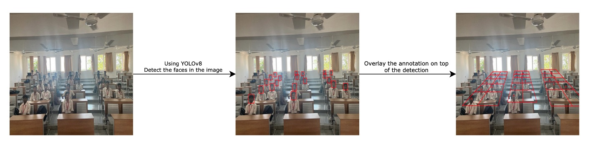

# Autondance Server

This web server serves as the foundational infrastructure for the Autondance project, facilitating essential APIs for image upload and attendance review functionalities. The subsequent flowchart illustrates the systematic process involved in image processing within the project framework.



# Setup

```bash
git clone https://github.com/solvedbiscuit71/autondance-demo-server.git
cd autondance-demo-server
```

## Intalling Poetry

We are using poetry as the package manager and build tool.

For Linux, macOS, Windows (WSL)
```sh
curl -sSL https://install.python-poetry.org | python3 -
```

For Windows (Powershell)
```sh
(Invoke-WebRequest -Uri https://install.python-poetry.org -UseBasicParsing).Content | py -
```

**NOTE: Don't forget to add poetry to your $PATH,**

`$HOME/.local/bin` For Linux, macOS, Windows (WSL)  
`%APPDATA%\Python\Scripts` For Windows

## Install the dependencies

To install dependency, inside the cloned directory run,
```sh
poetry install
```

## Setup env variables

Create a new file `.env` in the root of the project and add the host and port. `<...>` indicate a placeholder
```
API_HOST=<ip>
API_PORT=<port-number>
DATABASE_URL=mysql+mysqlconnector://<user>:<password>@<host>/<database>
```

## Setup database

In this project, There is a predefined dataset for all the tables required by the server. To create and insert the values into these tables run,
```bash
poetry run python scripts/migrate.py
```

## Start the server

To start the server, run
```bash
poetry run python main.py
```

This starts the server at http://127.0.0.1:8000 (by default). For API reference check out http://127.0.0.1:8000/docs and http://127.0.0.1:8000/redoc
